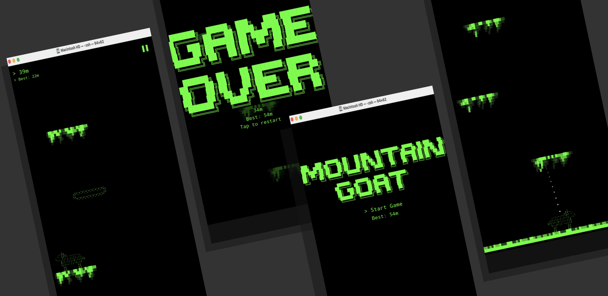
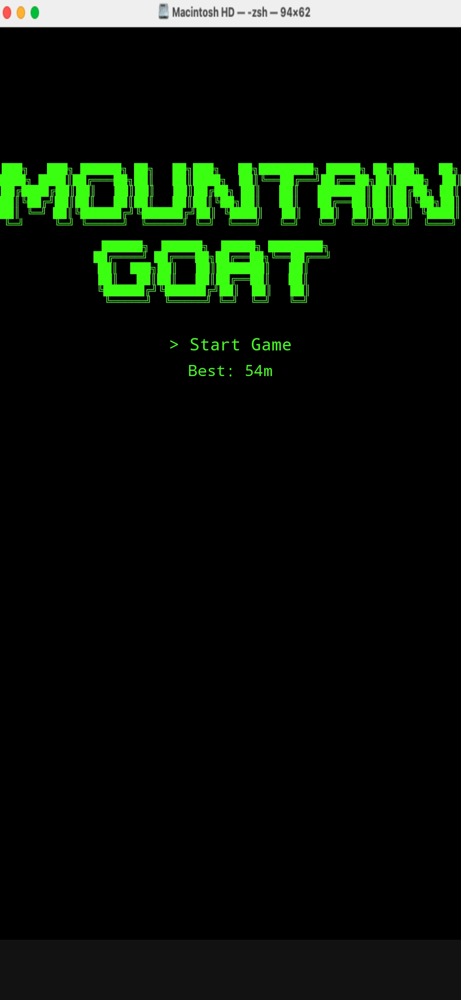
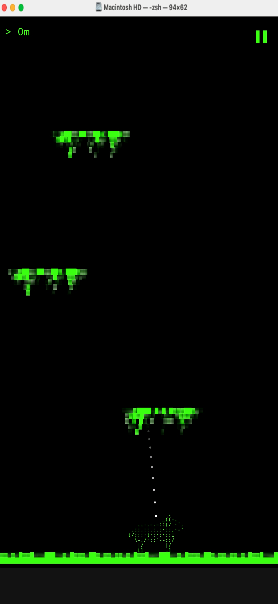
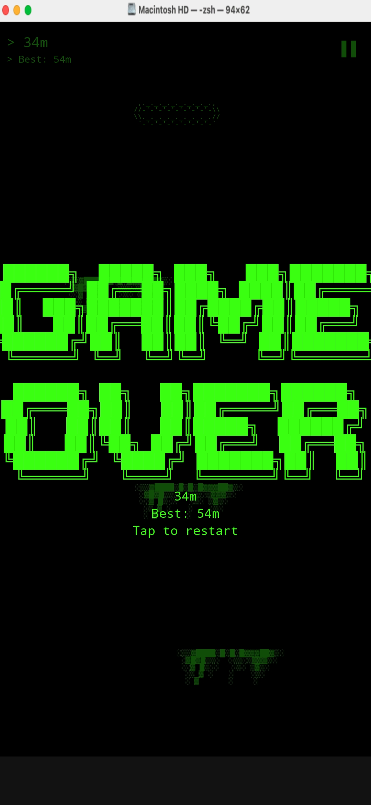

# Mountain Goat

An ASCII art vertical jumping game for Android where you control a mountain goat climbing higher and higher using a slingshot mechanic.

  <table>                                                                                            
    <tr>                                                    
      <td></td>                                       
      <td></td>                                       
      <td></td>
    </tr>
  </table>

## Features

- ASCII art graphics with a charming mountain goat character
- Slingshot mechanic for launching the goat upward
- Procedurally generated platforms
- Level progression system
- High score tracking

## Building

This is a standard Android project built with Gradle. Open in Android Studio and run.

### Requirements

- Android Studio Arctic Fox or newer
- Minimum SDK: API 24 (Android 7.0)
- Target SDK: API 34

## Development Process
This is in the DEVELOPMENT_PLAN.md file

## License

Private project - All rights reserved
